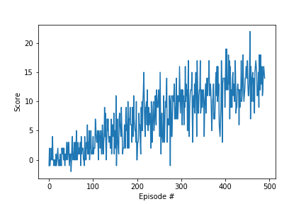
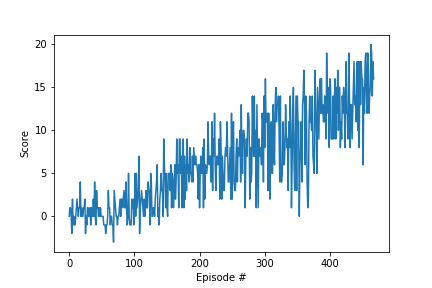

# Intro

---

In this project we had to apply the deep reinforcement learning to train an agent to navigate (and collect bananas!) in a large, square world.

The simulation contains a single agent that navigates a large environment.  At each time step, it has four actions at its disposal:
- `0` - walk forward
- `1` - walk backward
- `2` - turn left
- `3` - turn right

The state space has `37` dimensions and contains the agent's velocity, along with ray-based perception of objects around agent's forward direction.  A reward of `+1` is provided for collecting a yellow banana, and a reward of `-1` is provided for collecting a blue banana.

The task is episodic, and in order to solve the environment, your agent must get an average score of +13 over 100 consecutive episodes.


### 1. Solution
For solving the problem I've chosen to use 2 different learning algorithm:
- QN with replay buffer
- Duelling QN with replay buffer

### 1.1 QN  with replay buffer

The QN network with the replay buffer has the following hyperparameters:
BUFFER_SIZE = int(1e5)  # replay buffer size
BATCH_SIZE = 64         # minibatch size
GAMMA = 0.99            # discount factor
TAU = 1e-3              # for soft update of target parameters
LR = 5e-4               # learning rate
UPDATE_EVERY = 4        # how often to update the network

By using QN, the agent was able to train itself as follows:
```


    Model: QNetwork
    Episode 100	Average Score: 1.06
    Episode 200	Average Score: 4.55
    Episode 300	Average Score: 7.79
    Episode 400	Average Score: 10.68
    Episode 490	Average Score: 13.02
    Environment solved in 390 episodes!	Average Score: 13.02

```




### 1.2 Dueling DQN  with replay buffer
The second implemented algorithm was a DuelingDQN.
The idea behind a DuelingDQN is to use two streams. One for the state value function **V(s)** and one that estimates the  
advantage vor each action **A(s,a)**. The desired Q-values are obtained by combining the state and  
advantage values **Q(s,a) = V(s) + A(s,a)**.

By using Dueling DQN, the agent was able to train itself as follows:


```


    Model: DuelingDQN
    Episode 100	Average Score: 0.48
    Episode 200	Average Score: 3.58
    Episode 300	Average Score: 6.92
    Episode 400	Average Score: 9.87
    Episode 468	Average Score: 13.06
    Environment solved in 368 episodes!	Average Score: 13.06

```




### 2 Run the trained Models

When I run the trained agents for the both algorithms, I got the following results:

```    
    Model: QNetwork
    Solved after 299 iterations. 	Total reward: 3.00
    Episode 1	Average Score: 3.00

    Model: DuelingDQN
    Solved after 299 iterations. 	Total reward: 17.00
    Episode 1	Average Score: 17.00
```

### 3 Conclusion
Even if for the training, both algorithm were learning  in a closed number of episodes, on running the trained model
the DuelingDQN is superior to the QNetwork on the total reward achieved by the agent.

### 4 Ideas for Future Work

DuelingDQN and QNetwork were used to train the agent for collecting bananas. The training performance and the total reward for the agent are not bad, but improvable.

Possible improvements could achieved by using The [Rainbow](https://arxiv.org/abs/1710.02298) algorithm in a combination with:  

 - [Dueling DQN](https://arxiv.org/abs/1511.06581)   
 - [Prioritized experience replay](https://arxiv.org/abs/1511.05952)  
 - [Distributional DQN](https://arxiv.org/abs/1710.10044)
